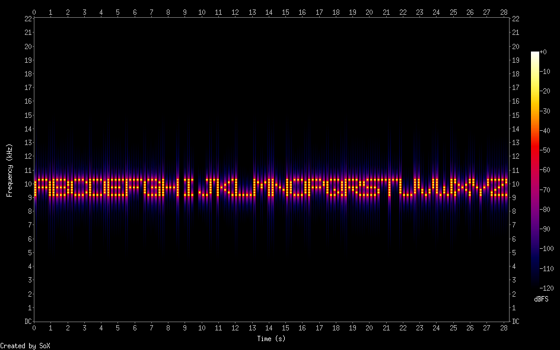

# ascii-audio
Generates PCM audio from an ASCII string. Text is visible on the spectrogram image.


##BUILDING
```
cd ascii-audio
make
```
##USAGE
```bash
ascii-audio -i input\ string -f 440 -b 1000 -o audio_out.raw
```
You could also use it with a pipe like this: 
```bash
echo ABCDEFGHIJKLMNOPQRSTUVWXYZ | ascii-audio -i -
```
##OPTIONS
```
-i [input string]   (required)
-f [base frequency] (optional, default: 1000)
-b [bandwidth]      (optional, default: 1200)
-o [output file]    (optional, default: out.raw)
```
##OUTPUT
This will generate a 48k/32-bit floating point raw PCM file. You can listen to it with SoX like this:

`play -c 1 -r 48000 -b 32 -e float -t raw out.raw`

Generating a spectrogram with SoX looks like this:

`sox -c 1 -r 48000 -b 32 -e float -t raw out.raw -n spectrogram`
